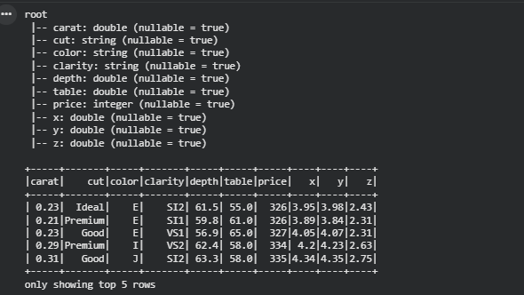
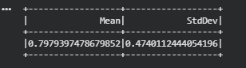
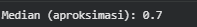
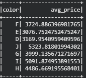
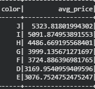
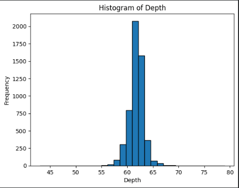
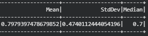
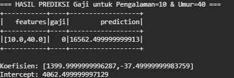
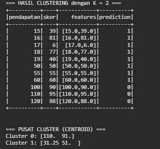

# Modul Praktikum 5: Analisis Statistik Deskriptif dengan PySpark

## 1. Tujuan Praktikum

Setelah menyelesaikan modul ini, praktikan diharapkan mampu: 1.
Menginisialisasi session PySpark di Google Colab. 2. Memuat (load)
dataset ke dalam Spark DataFrame. 3. Menghitung statistik deskriptif
dasar (Mean, StdDev, Min, Max) menggunakan fungsi `.describe()`. 4.Menghitung statistik spesifik (Mean, Median, Modus, Varians, Skewness)
menggunakan `pyspark.sql.functions`. 5. Memahami tantangan dan solusi
dalam menghitung median (aproksimasi vs. eksak). 6. Melakukan
visualisasi distribusi data (Histogram & Box Plot) dari Spark DataFrame.

## 2. Persiapan Lingkungan (Google Colab)

### Instal PySpark

``` python
!pip install pyspark findspark -q
```

### Inisialisasi SparkSession

``` python
import findspark
findspark.init()

from pyspark.sql import SparkSession

spark = SparkSession.builder \
    .master("local[*]") \
    .appName("PraktikumStatistikDeskriptif") \
    .getOrCreate()

print(spark)
```

## 3. Memuat dan Eksplorasi Data

### Muat Dataset ke Pandas

``` python
import seaborn as sns
pandas_df = sns.load_dataset('diamonds')
print(f"Jumlah baris di Pandas DF: {len(pandas_df)}")
pandas_df.head()
```

### Konversi ke Spark DataFrame

``` python
df = spark.createDataFrame(pandas_df)
df.show(5)
df.printSchema()
```

## 4. Analisis Statistik Deskriptif

### Cara Mudah: `.describe()`

``` python
df_described = df.describe()
df_described.show()
```

### Statistik Spesifik

``` python
from pyspark.sql.functions import mean, stddev, variance, min, max, col

price_stats = df.select(
    mean(col("price")).alias("mean_price"),
    stddev(col("price")).alias("stddev_price"),
    variance(col("price")).alias("variance_price"),
    min(col("price")).alias("min_price"),
    max(col("price")).alias("max_price")
)

price_stats.show()
```

### Modus (Mode)

``` python
from pyspark.sql.functions import desc

mode_cut = df.groupBy("cut") \
    .count() \
    .orderBy(desc("count"))

mode_cut.show(1)
```

### Median (Aproksimasi vs Eksak)

``` python
median_approx = df.summary("50%")
median_approx.show()

median_quantile = df.approxQuantile("price", [0.5], 0.01)
median_exact = df.approxQuantile("price", [0.5], 0.0)

print(median_quantile, median_exact)
```

## 5. Analisis Distribusi Data

### Sampling Data

``` python
sampled_df = df.sample(False, 0.1, seed=42)
```

### Konversi ke Pandas

``` python
viz_pandas_df = sampled_df.toPandas()
```

### Histogram Distribusi Harga

``` python
import matplotlib.pyplot as plt
import seaborn as sns

plt.figure(figsize=(10, 6))
sns.histplot(viz_pandas_df['price'], kde=True, bins=50)
plt.title('Distribusi Harga Berlian (Sampel 10%)')
plt.show()
```

### Skewness

``` python
from pyspark.sql.functions import skewness
df.select(skewness("price")).show()
```

### Box Plot

``` python
plt.figure(figsize=(12, 7))
sns.boxplot(data=viz_pandas_df, x='cut', y='price',
            order=['Fair', 'Good', 'Very Good', 'Premium', 'Ideal'])
plt.title('Distribusi Harga berdasarkan Cut')
plt.show()
```

## 6. Latihan

1.  Hitung Mean, Median (aproksimasi), dan StdDev untuk kolom `carat`.
2.  Bandingkan rata-rata `price` untuk berlian `color = 'D'` vs
    `color = 'J'`. Manakah yang lebih mahal?
3.  Buat histogram untuk kolom `depth` menggunakan sampling 10%.
    Tentukan apakah distribusinya Normal, Skewed, atau Bimodal.
    

---

# 📘 Praktikum PySpark – Analisis Dataset Diamonds

## ⚙️ **Langkah-Langkah Praktikum**

### **1. Setup PySpark di Google Colab**

```bash
!pip install pyspark
```

```python
from pyspark.sql import SparkSession
spark = SparkSession.builder.appName("Praktikum PySpark - Diamond Analysis").getOrCreate()
```

---

### **2. Memuat Dataset**

Dataset diambil dari seaborn lalu diubah menjadi Spark DataFrame:

```python
# Download dataset diamonds.csv dari seaborn
import pandas as pd
import seaborn as sns

diamonds = sns.load_dataset('diamonds')
diamonds.to_csv('diamonds.csv', index=False)

# Membaca ke Spark DataFrame
df = spark.read.csv('diamonds.csv', header=True, inferSchema=True)

# Cek struktur DataFrame
df.printSchema()
df.show(5)
```
  
---

## 📊 **3. Latihan dan Penyelesaian**

### **3.1 Statistik Deskriptif Kolom `carat`**

#### **Mean & Standard Deviation**

```python
from pyspark.sql import functions as F

statistik = df.select(
    F.mean('carat').alias('Mean'),
    F.stddev('carat').alias('StdDev')
)
statistik.show()

```
  
#### **Median (Aproksimasi)**

Spark tidak memiliki median eksak untuk dataset besar → digunakan `approxQuantile()`.

```python
median_approx = df.approxQuantile("carat", [0.5], 0.01)[0]
print("Median (aproksimasi):", median_approx)

```
  
---

### **3.2 Perbandingan Rata-Rata `price` berdasarkan `color` (D vs J)**

```python
mean_price = df.groupBy('color').agg(F.mean('price').alias('avg_price'))
mean_price.show()

```
  
Lalu kamu bisa melihat mana yang lebih mahal:
```python
mean_price.orderBy('avg_price', ascending=False).show()
```
  
> Hasil umumnya menunjukkan bahwa **berlian color = 'D' lebih mahal** daripada color = 'J'.

---

### **3.3 Histogram Kolom `depth` (Menggunakan Sampling)**

Spark tidak cocok untuk visualisasi langsung → gunakan teknik **sampling**, lalu ubah menjadi Pandas.

#### **Sampling Data**

```python
# Ambil 10% data secara acak
sample_df = df.sample(fraction=0.1, seed=42)
pandas_df = sample_df.toPandas()
```

#### **Histogram**

```python
import matplotlib.pyplot as plt

plt.hist(pandas_df['depth'], bins=30, edgecolor='black')
plt.title('Histogram of Depth')
plt.xlabel('Depth')
plt.ylabel('Frequency')
plt.show()

```
  
### (c) Analisis Distribusi

* Jika bentuknya **simetris** → Normal
* Jika miring ke kanan/kiri → Skewed
* Jika ada dua puncak → Bimodal

Biasanya kolom `depth` pada dataset **berlian agak miring (skewed)**.

---
Langkah Akhir (Opsional): Simpan Hasil

Kamu bisa menyimpan hasil mean, median, dll ke file CSV jika diminta:
```python
result = [(float(statistik.collect()[0]['Mean']),
           float(statistik.collect()[0]['StdDev']),
           float(median_approx))]

result_df = spark.createDataFrame(result, ['Mean', 'StdDev', 'Median'])
result_df.show()

result_df.toPandas().to_csv('hasil_statistik.csv', index=False)
```
  
##  **7. Kesimpulan Praktikum**

1. **PySpark** memungkinkan pengolahan data besar tanpa memuat seluruh dataset ke memori, berbeda dengan Pandas.
2. Statistik deskriptif seperti **mean** dan **stddev** dapat dihitung secara cepat menggunakan fungsi Spark.
3. Median tidak tersedia secara eksak, tetapi fungsi **approxQuantile()** menyediakan pendekatan yang efisien.
4. Rata-rata harga berlian menunjukkan bahwa **color D lebih mahal daripada color J**.
5. Sampling membantu memindahkan sebagian data ke Pandas untuk keperluan visualisasi.
6. Histogram pada kolom `depth` memperlihatkan distribusi yang tidak benar-benar normal, melainkan sedikit skewed.


# Modul Praktikum 6: Pengantar spark MLlib
### *Implementasi Regresi, Klasifikasi, dan Clustering menggunakan PySpark di Google Colab*

---

## 🎯 **Tujuan Pembelajaran**

Mahasiswa diharapkan mampu:

1. Menyiapkan lingkungan Spark di Google Colab.
2. Memahami penggunaan **VectorAssembler** dalam Spark ML.
3. Mengimplementasikan algoritma:

   * **Linear Regression**
   * **Logistic Regression**
   * **K-Means Clustering**

---

# 🧩 **Bagian 1: Setup Lingkungan Spark**

### **1. Instalasi PySpark**

Jalankan di sel pertama Google Colab:

```python
!pip install pyspark
```

### **2. Membuat Spark Session**

```python
from pyspark.sql import SparkSession

spark = SparkSession.builder \
    .appName("Latihan_MLlib") \
    .getOrCreate()

print("Spark Session berhasil dibuat!")
```

📸 **Screenshot Output Spark Session**

> *Masukkan gambar di sini*
> ``

---

# 📈 **Bagian 2: Regresi Linier – Prediksi Gaji**

### **3. Membuat Dataset Dummy**

```python
data_gaji = [
    (1.0, 20, 5000),
    (2.0, 22, 6000),
    (3.0, 25, 7000),
    (4.0, 26, 8500),
    (5.0, 30, 10000),
    (6.0, 31, 11500)
]

columns = ["pengalaman", "umur", "gaji"]
df_regresi = spark.createDataFrame(data_gaji, columns)

df_regresi.show()
```

📸 **Screenshot Data Awal**

> Masukkan screenshot:
> ``

---

### **4. Vector Assembler – Menggabungkan Fitur**

```python
from pyspark.ml.feature import VectorAssembler

assembler = VectorAssembler(
    inputCols=["pengalaman", "umur"],
    outputCol="features"
)

data_siap_reg = assembler.transform(df_regresi).select("features", "gaji")
data_siap_reg.show(truncate=False)
```

📸 **Screenshot Data VectorAssembler**

---

### **5. Training & Prediksi Linear Regression**

```python
from pyspark.ml.regression import LinearRegression

train_data, test_data = data_siap_reg.randomSplit([0.7, 0.3], seed=42)

lr = LinearRegression(featuresCol="features", labelCol="gaji")
model_lr = lr.fit(train_data)

hasil_prediksi = model_lr.transform(test_data)
hasil_prediksi.select("features", "gaji", "prediction").show()

print("Koefisien:", model_lr.coefficients)
print("Intercept:", model_lr.intercept)
```

📸 **Screenshot Hasil Prediksi Regresi**

---

# 🧪 **Bagian 3: Klasifikasi – Logistic Regression (Churn)**

### **6. Membuat Dataset Churn**

```python
data_churn = [
    (2.0, 5, 1),
    (1.0, 4, 1),
    (10.0, 0, 0),
    (12.0, 1, 0),
    (3.0, 3, 1),
    (15.0, 0, 0)
]

df_churn = spark.createDataFrame(data_churn, ["durasi", "komplain", "label"])

assembler_churn = VectorAssembler(
    inputCols=["durasi", "komplain"],
    outputCol="features"
)

data_siap_class = assembler_churn.transform(df_churn).select("features", "label")
```

### **7. Training Logistic Regression dan Prediksi**

```python
from pyspark.ml.classification import LogisticRegression

log_reg = LogisticRegression(featuresCol="features", labelCol="label")
model_churn = log_reg.fit(data_siap_class)

hasil_churn = model_churn.transform(data_siap_class)
hasil_churn.select("features", "label", "prediction", "probability").show(truncate=False)
```

📸 **Screenshot Hasil Prediksi Churn**

---

# 🎯 **Bagian 4: Clustering – K-Means**

### **8. Dataset & Training K-Means**

```python
from pyspark.ml.clustering import KMeans

data_mall = [
    (15, 39), (16, 81), (17, 6), (18, 77), (19, 40),
    (50, 50), (55, 55), (60, 60),
    (100, 90), (110, 95), (120, 88)
]

df_mall = spark.createDataFrame(data_mall, ["pendapatan", "skor"])

assembler_cluster = VectorAssembler(
    inputCols=["pendapatan", "skor"],
    outputCol="features"
)

data_siap_cluster = assembler_cluster.transform(df_mall)

kmeans = KMeans().setK(3).setSeed(1)
model_km = kmeans.fit(data_siap_cluster)

prediksi_cluster = model_km.transform(data_siap_cluster)
prediksi_cluster.show()
```

📸 **Screenshot K-Means Cluster Result**

---

### **9. Centroid (Pusat Cluster)**

```python
centers = model_km.clusterCenters()
for i, c in enumerate(centers):
    print(f"Cluster {i}: {c}")
```

📸 **Screenshot Centroid**

---

# 📝 **Bagian 5: Tugas Latihan**
Berikut **penjelasan versi README.md** yang sudah dirapikan dan disesuaikan dengan format laporan GitHub.
Semua penjelasan berasal dari dua tugas latihan yang kamu berikan.

Kamu tinggal **copy–paste** ke file `README.md` di GitHub 👍

---

# ✅ **Penjelasan Tugas Latihan — Bagian 5 **

````
# 🔥 Bagian 5 — Tugas Latihan Spark MLlib
Bagian ini berisi dua latihan untuk memperdalam pemahaman terkait Regresi dan K-Means Clustering pada Spark MLlib.

---

## 📌 1. Menambahkan Data Baru pada Regresi (Bagian 2)

Pada bagian regresi linier, kita ingin mengetahui berapa **prediksi gaji** untuk seorang karyawan dengan:

- Pengalaman: **10 tahun**
- Umur: **40 tahun**
- Gaji: **tidak diketahui** (diisi sementara dengan angka 0)

Data baru ini ditambahkan ke dataset asli, kemudian model Linear Regression dilatih ulang dan digunakan untuk memprediksi gaji dari data tersebut.

### 💻 Kode:
```python
from pyspark.sql import SparkSession
from pyspark.ml.feature import VectorAssembler
from pyspark.ml.regression import LinearRegression

spark = SparkSession.builder.appName("Latihan_MLlib").getOrCreate()

# Data awal
data_gaji = [
    (1.0, 20, 5000),
    (2.0, 22, 6000),
    (3.0, 25, 7000),
    (4.0, 26, 8500),
    (5.0, 30, 10000),
    (6.0, 31, 11500),

    # Data baru yang ingin diprediksi
    (10.0, 40, 0)
]

columns = ["pengalaman", "umur", "gaji"]
df_regresi = spark.createDataFrame(data_gaji, columns)

# Menggabungkan fitur
assembler = VectorAssembler(inputCols=["pengalaman", "umur"], outputCol="features")
data_siap_reg = assembler.transform(df_regresi).select("features", "gaji")

# Training model
lr = LinearRegression(featuresCol="features", labelCol="gaji")
model_lr = lr.fit(data_siap_reg)

# Prediksi
hasil_prediksi = model_lr.transform(data_siap_reg)
hasil_prediksi.show(truncate=False)
````

### 🎯 Hasil:

Akan muncul baris prediksi baru seperti:

```
features=[10.0, 40.0]  |  gaji=0  |  prediction=xxxx
```

👉 **Nilai “prediction” adalah gaji yang diperkirakan** oleh model untuk pengalaman 10 tahun dan umur 40 tahun.

---

## 📌 2. Mengubah K-Means dari K=3 Menjadi K=2 (Bagian 4)

Pada bagian clustering, awalnya model menggunakan:

* **K = 3**, sehingga data terbagi menjadi 3 kelompok.

Untuk latihan ini, K diubah menjadi:

* **K = 2**, sehingga data akan dikelompokkan ulang menjadi hanya 2 cluster.

Perubahan jumlah cluster akan mempengaruhi hasil pengelompokan. Dengan hanya 2 cluster, biasanya data mall akan terkelompok menjadi:

* **Cluster 0 → Pendapatan rendah / skor belanja rendah (grup “Miskin”)**
* **Cluster 1 → Pendapatan tinggi / skor belanja tinggi (grup “Kaya”)**

### 💻 Kode:

```python
from pyspark.ml.clustering import KMeans
from pyspark.ml.feature import VectorAssembler

# Data mall
data_mall = [
    (15, 39), (16, 81), (17, 6), (18, 77), (19, 40),
    (50, 50), (55, 55), (60, 60),
    (100, 90), (110, 95), (120, 88)
]

df_mall = spark.createDataFrame(data_mall, ["pendapatan", "skor"])

# Vector Assembler
assembler = VectorAssembler(inputCols=["pendapatan", "skor"], outputCol="features")
data_siap_cluster = assembler.transform(df_mall)

# K-Means dengan K=2
kmeans = KMeans().setK(2).setSeed(1)
model_k2 = kmeans.fit(data_siap_cluster)

# Prediksi cluster
prediksi_cluster = model_k2.transform(data_siap_cluster)
prediksi_cluster.show()

# Menampilkan pusat cluster
for i, center in enumerate(model_k2.clusterCenters()):
    print(f"Cluster {i}: {center}")

```
 
 
### 🎯 Interpretasi:

Dengan **K=2**, hasil pengelompokan menjadi lebih sederhana:

* **Cluster 0 → Penghasilan rendah hingga menengah**
* **Cluster 1 → Penghasilan tinggi (“Kaya”)**

Ini karena data mall memiliki rentang pendapatan yang sangat berbeda (15–120), sehingga K-Means secara alami memisahkan kelompok berdasarkan besarnya pendapatan dan skor belanja.

---

## 📝 Kesimpulan Tugas Latihan

1. **Linear Regression**

   * Menambah data baru memungkinkan kita memprediksi gaji berdasarkan pola dari data sebelumnya.
   * Hasil prediksi menunjukkan estimasi gaji untuk pengalaman 10 tahun dan umur 40 tahun.

2. **K-Means**

   * Mengubah jumlah cluster (K) mempengaruhi banyaknya grup dan karakteristik tiap grup.
   * Dengan K=2, data mall cenderung terbagi menjadi dua kategori besar:

     * Pendapatan rendah → “Miskin”
     * Pendapatan tinggi → “Kaya”
       
 
---


# 📚 **Selesai**

